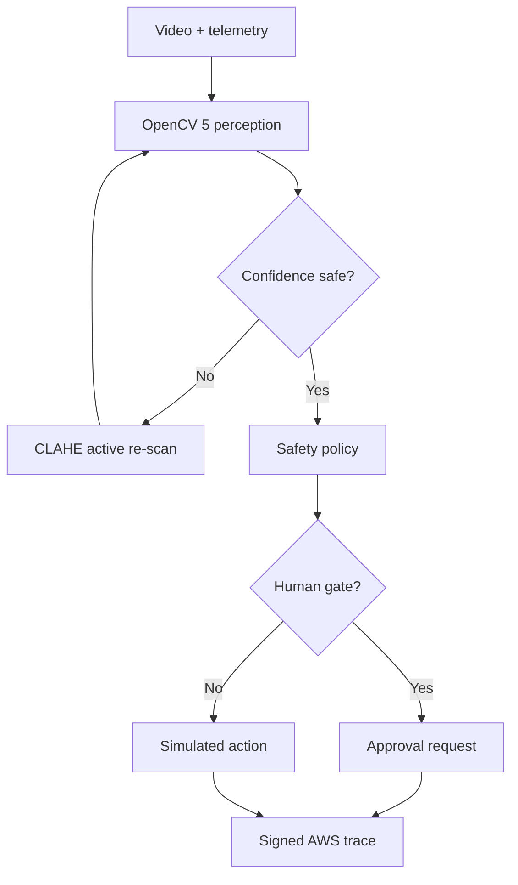

# AegisLand — Agentic Vision for Emergency Drone Landing

> When navigation becomes uncertain, AegisLand turns OpenCV evidence into a safer next action—then preserves the full reason-and-action trace.

AegisLand is a safety-first prototype for the **OpenCV AI Competition 2026, powered by AWS**. A deterministic drone simulator injects low battery, GPS loss, poor illumination, static obstacles, and moving-zone intrusions. An OpenCV 5 perception stack scores candidate landing regions; an auditable safety planner chooses whether to continue, return, hold and rescan, request approval, evade, or land.

The important part is the closed loop: **a visual result changes the next tool call or action**. Low confidence triggers a second OpenCV pass with CLAHE exposure recovery. Moving-object evidence can cancel a landing and trigger evasive hold. Ambiguous high-risk cases stop at a human approval gate.

## Why this is more than a vision chatbot

| OpenCV evidence | Agent response |
| --- | --- |
| Low contrast / low confidence | Enhance the frame and invoke OpenCV again |
| Motion enters the best landing zone | Reject that zone and change the flight intent |
| Clear zone + emergency battery | Select a target zone and simulate landing |
| No safe zone + noncritical reserve | Hold/rescan or request operator approval |
| Collision risk exceeds envelope | Evasive hold overrides the mission plan |

No large language model is allowed to bypass the safety policy. The current command adapter is deliberately simulation-only and never sends a hardware command.

## OpenCV 5 pipeline

- Canny edge structure and morphological closing
- Laplacian texture risk
- Median-relative appearance occupancy
- Dense Farneback optical flow
- Motion-mask morphology and contour bounding boxes
- Grid candidate generation, clearance, and multi-cue scoring
- CLAHE-based active perception on low-confidence frames
- Annotated MP4 evidence and per-frame latency

## Quick start on Windows PowerShell

Python 3.11 or 3.12 is recommended.

```powershell
git clone https://github.com/Cyberchopin/aegisland-agentic-vision.git
cd aegisland-agentic-vision
py -3.12 -m venv .venv
.\.venv\Scripts\Activate.ps1
python -m pip install --upgrade pip
pip install -e ".[dev]"
python -m aegisland demo --scenario low_battery_intrusion --output runs\latest
python -m aegisland serve --directory runs\latest
```

The demo generates:

- `annotated.mp4` — judge-facing vision and action overlay
- `trace.jsonl` — replayable telemetry → evidence → decision → command history
- `summary.json` — headline benchmark data
- `report.html` — self-contained mission evidence dashboard

Run all deterministic scenarios:

```powershell
python -m aegisland evaluate --output runs\evaluation
pytest
```

## Architecture



The local loop remains functional if AWS is offline. Cloud delivery is evidence/observability—not a dependency that can block the safety loop. See [architecture.md](docs/architecture.md) for trust boundaries and component details.

## AWS evidence backend

The SAM template deploys an IAM-authorized HTTP API, an Arm64 Lambda function, a DynamoDB trace index, and a private encrypted S3 evidence bucket. Raw traces expire after 30 days; the DynamoDB table uses TTL and point-in-time recovery.

```bash
./scripts/deploy_aws.sh creditbridge us-east-1
```

The script uses a confirmation-gated CloudFormation changeset. After deployment, set the output value locally:

```powershell
$env:AEGISLAND_TRACE_ENDPOINT="https://YOUR_API_ID.execute-api.us-east-1.amazonaws.com/v1"
$env:AWS_PROFILE="creditbridge"
python -m aegisland demo --scenario gps_loss_low_light --output runs\cloud-demo
```

Do not deploy until an AWS Budget alert is active. The stack uses on-demand/serverless services but can still incur charges.

## Evaluation contract

We report task success, unsafe-landing rate, hazard reaction frames, human-control routing, p50/p95 perception latency, and trace completeness. Every final chart must come from committed inputs and scripts; no hand-entered benchmark numbers. The metric definitions and failure matrix live in [evaluation.md](docs/evaluation.md).

## Safety and responsible-use boundaries

- Research and hackathon prototype; **not flight-certified**.
- Simulation-only adapter by default; no motor or autopilot command is sent.
- The landing-zone score is a heuristic safety indicator, not semantic certainty.
- No face recognition, identity tracking, or cloud upload of raw bystander video.
- Human approval is mandatory for ambiguous high-risk action unless battery is already below the critical reserve.
- A real PX4/DroneKit adapter must add geofencing, command acknowledgements, independent failsafes, and hardware-in-the-loop validation.

## Project map

```text
src/aegisland/       perception, agent loop, policy, simulation, reporting
tests/               safety invariants and evidence-driven action tests
evaluation/          committed scenario/metric contract
infra/               AWS SAM evidence backend
docs/                architecture, evaluation, grant proposal, lessons
.github/workflows/   reproducible CI and evidence artifact
```

## Competition plan

The MVP intentionally targets the **Agentic Vision Award** first. COOL/Graviton benchmarking is a Phase 3 opt-in only after the baseline is stable; this avoids claiming an optimization before it is measured. Use the [judge evidence scorecard](docs/judging-scorecard.md), [build-to-win roadmap](docs/roadmap.md), and [grant proposal](docs/grant-proposal.md) to drive each iteration.

## Status

Version `0.1.0`: synthetic scenarios, OpenCV 5 multi-cue perception, active re-scan, policy planner, human gate, trace dashboard, tests, CI, and AWS evidence infrastructure.
