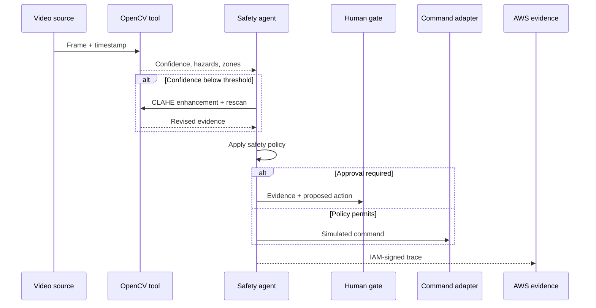

# Architecture and trust boundaries

## Design thesis

AegisLand separates probabilistic perception from irreversible action. OpenCV may estimate whether a region looks clear, but a deterministic policy owns safety transitions. This creates three independently testable questions:

1. Did perception measure the scene correctly?
2. Did evidence change the chosen action correctly?
3. Was the action permitted, blocked, and recorded correctly?

## Perception–decision–action loop

## OpenCV implementation

| Cue | Operation | Safety meaning | Known failure |
| --- | --- | --- | --- |
| Structure | Gaussian blur → Canny → close | Penalize clutter/edges | Shadows can create false edges |
| Texture | Laplacian magnitude | Penalize rough regions | Smooth water can look deceptively flat |
| Appearance | Median-relative mask + morphology | Penalize large anomalous regions | Dark paint or shadows can look occupied |
| Motion | Farneback flow → threshold → morphology | Reject moving occupancy | Camera motion creates global flow |
| Clearance | Contour boxes + normalized distance | Keep distance from motion | Boxes are not semantic identities |
| Exposure | CLAHE retry | Recover detail in darkness | Cannot recover clipped pixels |

The next technical milestone is camera-motion compensation with feature matching and homography before flow-based occupancy.

## Safety precedence

Highest precedence wins:

1. Imminent collision/motion risk → evade and hold.
2. Battery below critical reserve → emergency land at the least-risk observed zone.
3. Unreliable vision → hold and actively rescan.
4. Emergency battery + verified zone → land.
5. Emergency battery + ambiguous zone → operator approval.
6. Return reserve → return home when navigation is available.
7. Nominal evidence → continue mission.

This order is encoded in `SafetyPlanner` and protected by unit tests.

## AWS boundary

The local loop is authoritative. The cloud endpoint stores immutable evidence events and must never be required to make a time-critical command.

- HTTP API accepts IAM SigV4-authenticated requests only.
- Lambda validates size and identity, and makes retries idempotent.
- DynamoDB indexes action/risk per trace sequence.
- S3 stores the full JSON event with encryption and a 30-day lifecycle.
- Client failures append locally and do not interrupt the loop.

## Future hardware adapter contract

A real adapter must implement command acknowledgements, timeout handling, autopilot state verification, geofencing, minimum-altitude logic, independent return/land failsafes, and hardware-in-the-loop test evidence. It cannot alter a policy decision or convert an approval-required result into an executed command.
